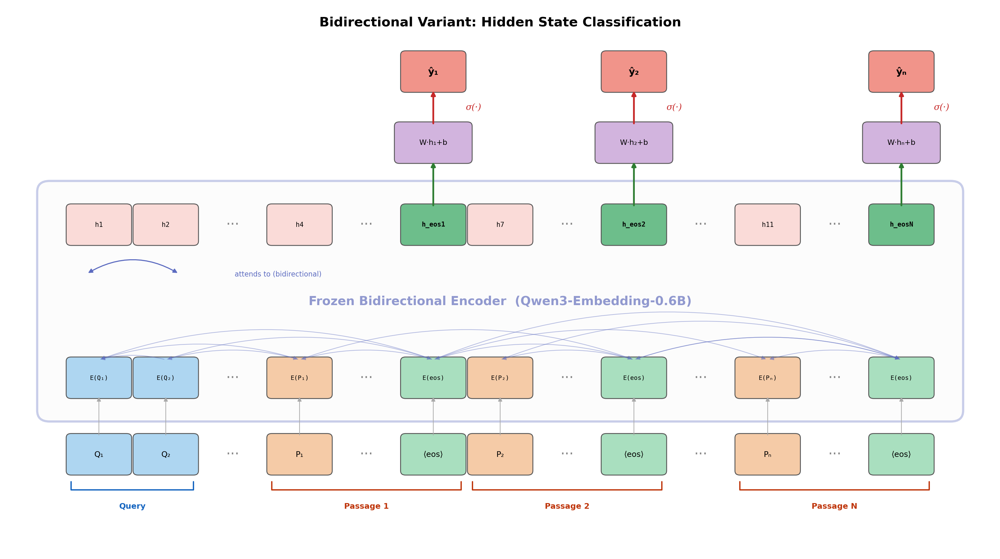

# Single-Pass Evidence Extraction via Hidden State Classification

Classify which passages are relevant to a multi-hop question by extracting hidden states from a single LLM forward pass — no autoregressive decoding required.

## Method

Given a query and N candidate passages, we concatenate them into a single input sequence and run one forward pass through a frozen LLM. The hidden state at each passage's EOS token is fed into a linear classification head to predict relevance (0/1). This enables inter-passage interaction while avoiding the cost of autoregressive generation.

We compare two backbone variants:
- **Causal LM** (Qwen3-0.6B): unidirectional inter-passage interaction
- **Bidirectional** (Qwen3-Embedding-0.6B): full bidirectional inter-passage interaction

Against four baselines:
- **Dual-Tower** (all-MiniLM-L6-v2): cosine similarity, no interaction
- **ModernBERT Dual-Tower** (hotchpotch/ModernBERT-embedding-CMNBRL): HotpotQA-related embedding baseline
- **Cross-Encoder** (ms-marco-MiniLM-L6-v2): query-passage interaction only
- **HotpotQA Cross-Encoder** (OloriBern/hotpotqa-mixer-2000): HotpotQA-related reranking baseline

We also evaluate LoRA fine-tuning on top of both frozen LLM backbones.

## Training Setup Notes

The models in the results table are not trained under the same supervision setting:

- **Generic off-the-shelf baselines:** `Dual-Tower` and `Cross-Encoder` are used as-is, without HotpotQA-specific training in this project.
- **Our HotpotQA-trained models:** `Causal LM`, `Bidirectional`, `Causal LM + LoRA`, and `Bidirectional + LoRA` all use HotpotQA supervision in our pipeline. The frozen variants train only the linear classifier head, while the LoRA variants additionally adapt the backbone through LoRA.
- **External in-domain baselines:** `ModernBERT Dual-Tower` and `HotpotQA Cross-Encoder` are external models that were already fine-tuned on HotpotQA-related data before evaluation here.

This distinction matters when comparing numbers: the generic baselines test out-of-the-box retrieval/reranking strength, while the frozen / LoRA variants and the two in-domain baselines benefit from task-specific HotpotQA supervision.

## Architecture

### Causal LM


### Bidirectional Variant


## Project Structure

```
├── experiment.ipynb        # Main end-to-end experiment notebook (run on Colab)
├── src/
│   ├── config.py           # Experiment configuration
│   ├── data.py             # HotpotQA data loading and preprocessing
│   ├── modeling.py         # Backbone loading, tokenization, classifier model
│   ├── train_eval.py       # Training loop, evaluation, threshold tuning
│   └── utils.py            # Helpers (seed, device, JSON I/O, formatting)
├── scripts/
│   └── draw_architecture.py # Architecture diagram generation
├── assets/                  # Generated figures (architecture diagrams)
├── proposal/
│   └── proposal.md         # Research proposal
└── artifacts/runs/         # Saved results (generated after running experiments)
    ├── causal/
    ├── causal_lora/
    ├── bidirectional/
    ├── bidirectional_lora/
    ├── dual_tower/
    ├── modernbert_dual_tower/
    ├── cross_encoder/
    └── hotpotqa_cross_encoder/
```

## Requirements

```
torch
transformers
datasets
sentence-transformers
tqdm
matplotlib
```

## Usage

1. Zip the `src/` folder and upload to Google Colab
2. Upload `experiment.ipynb` to Colab
3. Run all cells sequentially

The notebook handles data downloading, model loading, training, evaluation, and visualization. Results are saved to `artifacts/runs/`.

## Results (HotpotQA Distractor, Paragraph-level F1)

| Method | Overall F1 | Bridge F1 | Comparison F1 |
|--------|-----------|-----------|---------------|
| Dual-Tower | 0.519 | 0.496 | 0.616 |
| ModernBERT Dual-Tower | 0.553 | 0.512 | 0.712 |
| Cross-Encoder | 0.578 | 0.567 | 0.630 |
| HotpotQA Cross-Encoder | 0.782 | 0.742 | 0.944 |
| Bidirectional | 0.604 | 0.588 | 0.667 |
| Causal LM | 0.675 | 0.659 | 0.737 |
| **Bidirectional + LoRA** | **0.890** | **0.869** | **0.977** |
| Causal LM + LoRA | 0.884 | 0.861 | 0.977 |

Among the models trained within this project, the frozen causal LM is the strongest frozen variant, and LoRA fine-tuning gives the best overall results, with the bidirectional LoRA model narrowly achieving the top F1. Among baselines, the strongest generic baseline is the standard Cross-Encoder, while the strongest externally trained in-domain baseline is the HotpotQA Cross-Encoder.
