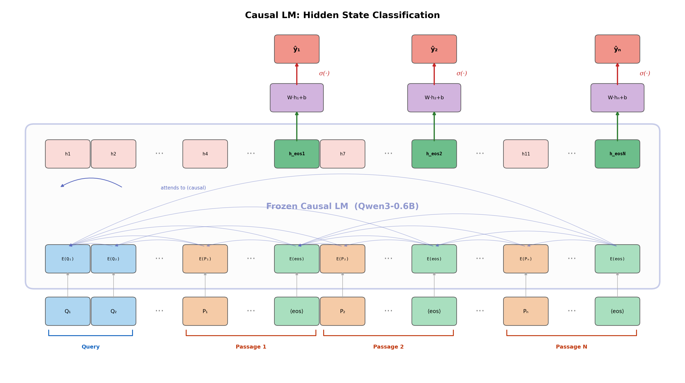
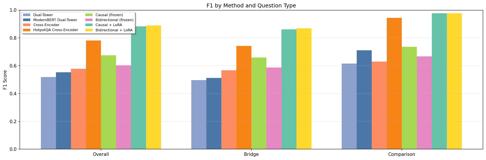
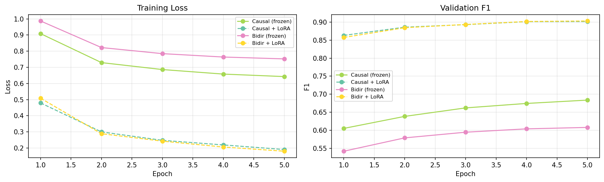

# Decode-Free Information Extraction

Classify which passages are relevant to a multi-hop question by extracting hidden states from a single LLM forward pass — no autoregressive decoding required.

## Motivation

Evidence selection — identifying which passages are relevant given a query — is a core component of RAG pipelines, open-domain QA, and multi-hop reasoning systems. Existing approaches each have fundamental limitations:

| Method | Approach | Key Limitation |
|--------|----------|----------------|
| Dual-Tower | Encode query and passages independently, rank by cosine similarity | No cross-attention; no inter-passage interaction |
| Cross-Encoder | Concatenate query with **each** passage, score independently | Rich query-passage interaction, but **zero inter-passage interaction**; encoder context windows (512 tokens) too small to fit all passages |
| LLM Generation | Prompt an LLM to judge relevance via generated text | Powerful reasoning, but **autoregressive decoding is slow** — even a "yes/no" per passage requires sequential token generation |

For multi-hop questions — where the relevance of one passage depends on information in another — independent scoring is theoretically insufficient. Yet the only approach that enables cross-passage reasoning (LLM generation) pays a heavy cost in decoding latency.

**Key insight:** We can combine the best of both worlds. LLMs offer context windows large enough (32K+ tokens) to fit a query and all candidate passages in a single sequence — far exceeding encoder limits. But instead of generating text, we directly classify each passage from its hidden state at the EOS token position. This gives us inter-passage interaction with zero decoding cost.

## Method

Given a query and N candidate passages, the input is concatenated into a single sequence:

```
Question: {query} Passage 1 Title: ... {text} [EOS] | Passage 2 ... [EOS] ... Passage N ... [EOS]
```

A single forward pass produces hidden states at every position. For each passage, we extract the hidden state at its EOS token and apply a binary classifier:

```
label_i = sigmoid(W · h_EOS_i + b)  →  0 (irrelevant) or 1 (relevant)
```

We investigate two backbone variants:

- **Causal LM (Qwen3-0.6B):** Each EOS token attends to the query and all preceding passages (unidirectional inter-passage interaction), leveraging general reasoning from next-token-prediction pretraining.
- **Bidirectional (Qwen3-Embedding-0.6B):** Each EOS token attends to all passages in both directions (full inter-passage interaction), with a contrastive-learning pretrained backbone.

Both are evaluated with a frozen backbone (only the linear head is trained) and with LoRA fine-tuning.

| Method | Query-Passage Interaction | Inter-Passage Interaction | Decoding Cost |
|--------|--------------------------|--------------------------|---------------|
| Dual-Tower | None | None | None |
| Cross-Encoder | Full (bidirectional) | None | None |
| LLM Generation | Full (causal) | Unidirectional | O(T) tokens |
| **Ours (Causal)** | Full (causal) | Unidirectional | **None** |
| **Ours (Bidirectional)** | Full (bidirectional) | Full | **None** |

## Architecture

### Causal LM


### Bidirectional


## Experiments

### Dataset: HotpotQA (Distractor Setting)

Each example contains a multi-hop question and 10 paragraphs (2 gold + 8 distractors), with sentence-level supporting fact annotations converted to paragraph-level binary labels. This dataset is ideal because multi-hop questions naturally require cross-paragraph reasoning, directly testing whether inter-passage interaction improves evidence selection.

### Baselines

- **Dual-Tower** (all-MiniLM-L6-v2): cosine similarity, no interaction
- **Cross-Encoder** (ms-marco-MiniLM-L6-v2): query-passage interaction only
- **ModernBERT Dual-Tower** (ModernBERT-embedding-CMNBRL): HotpotQA-related embedding model
- **HotpotQA Cross-Encoder** (hotpotqa-mixer-2000): HotpotQA-related reranker

**Training setup note:** Generic baselines (Dual-Tower, Cross-Encoder) are used off-the-shelf. Our models and the two in-domain baselines use HotpotQA supervision. Frozen variants train only the linear head; LoRA variants additionally adapt the backbone.

### Results

Paragraph-level F1 on 7,345 test examples:

| Method | Overall F1 | Bridge F1 | Comparison F1 |
|--------|-----------|-----------|---------------|
| Dual-Tower | 0.519 | 0.496 | 0.616 |
| ModernBERT Dual-Tower | 0.553 | 0.512 | 0.712 |
| Cross-Encoder | 0.578 | 0.567 | 0.630 |
| HotpotQA Cross-Encoder | 0.782 | 0.742 | 0.944 |
| Causal LM (frozen) | 0.675 | 0.659 | 0.737 |
| Bidirectional (frozen) | 0.604 | 0.588 | 0.667 |
| Causal LM + LoRA | 0.884 | 0.861 | 0.977 |
| **Bidirectional + LoRA** | **0.890** | **0.869** | **0.977** |




### Analysis

**Frozen backbones already encode relevance signals.** Even without fine-tuning, the causal LM (0.675 F1) outperforms both generic baselines — a dual-tower model (0.519) and a cross-encoder (0.578) — using only a linear head on frozen hidden states. This suggests pretrained LLM representations carry meaningful passage-relevance information that a simple classifier can extract.

**Causal attention outperforms bidirectional in the frozen setting.** The frozen causal LM (0.675) beats the frozen bidirectional model (0.604), despite the latter having full inter-passage attention. This likely reflects the stronger general-purpose representations from next-token-prediction pretraining versus the bidirectional model's contrastive-learning objective, which was optimized for embedding similarity rather than discriminative classification.

**LoRA fine-tuning closes the gap and achieves the best results.** With LoRA, both backbones reach ~0.89 F1, surpassing the HotpotQA-specific cross-encoder baseline (0.782) by a wide margin. The bidirectional model (0.890) narrowly edges out the causal variant (0.884), suggesting that full inter-passage attention provides a small advantage once the backbone is adapted to the task.

## Project Structure

```
├── main.py                  # Experiment entry point
├── src/
│   ├── config.py            # Experiment configuration
│   ├── data.py              # HotpotQA data loading and preprocessing
│   ├── modeling.py          # Backbone loading, tokenization, classifier
│   ├── train_eval.py        # Training loop, evaluation, threshold tuning
│   ├── baselines.py         # Dual-tower and cross-encoder baselines
│   ├── visualize.py         # Result plotting
│   └── utils.py             # Helpers (seed, device, JSON I/O)
├── scripts/
│   └── draw_architecture.py # Architecture diagram generation
├── figures/                 # All figures
├── tests/                   # Unit tests
├── artifacts/runs/          # Saved experiment results (JSON)
└── requirements.txt
```

## Usage

```bash
pip install -r requirements.txt
python main.py
```
